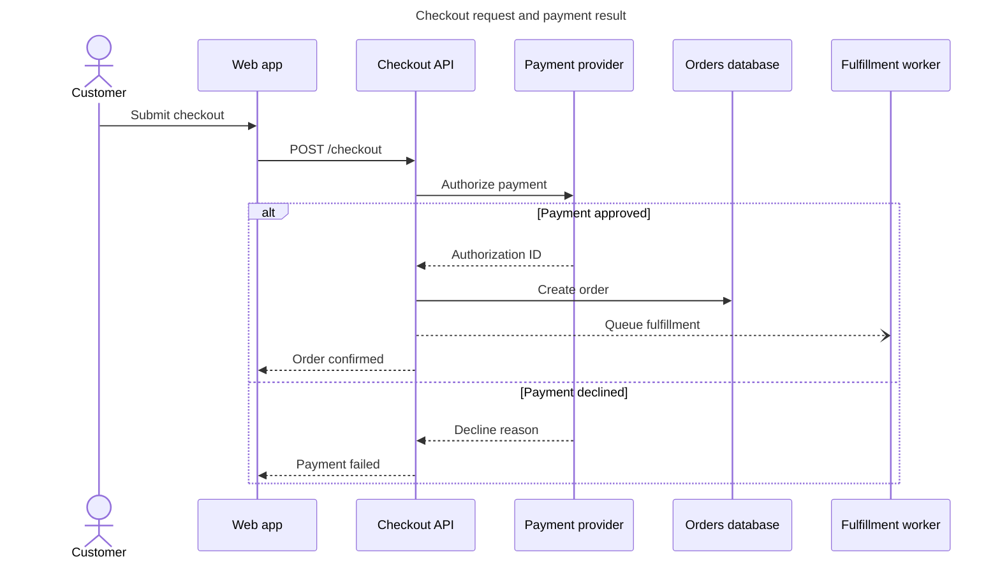

# Mermaid

Turn verified system knowledge into a focused Mermaid view that a reader can
understand, render, and maintain.

## Workflow

### 1. Establish the documentation truth

- Inspect the code, schemas, infrastructure, product docs, tickets, and existing
  diagrams that govern the requested view. Treat them as the source of truth.
- Identify the audience, the one question the diagram must answer, its intended
  host or output format, and the Mermaid version that will render it.
- Separate verified facts from inference. Ask only when an unresolved choice
  would materially change the view; otherwise omit uncertain detail or label it
  explicitly. Never make a diagram look complete by inventing behavior.
- If the diagram accompanies documentation, fit it to that page's primary need:
  show a controlled learning path in a tutorial, an actionable route and
  decisions in a how-to, exact structure in reference, or selected relationships
  and rationale in explanation. Do not produce four diagrams merely to satisfy
  the four modes.

### 2. Choose the smallest useful view

Read [references/diagram-design.md](references/diagram-design.md) before
planning, creating, or reviewing a diagram. Use its engineering-manager
selection table and composition rules.

- Give one diagram one viewer question. Split an overloaded view into an
  overview and one or more linked detail views.
- Default to a flowchart with subgraphs for portable system architecture.
  Choose C4 or `architecture-beta` only when its specialized semantics improve
  the answer and the target renderer supports that syntax.
- Prefer the least specialized diagram that communicates the facts without
  losing important meaning.

### 3. Draft maintainable Mermaid source

Read the selected section of
[references/syntax-patterns.md](references/syntax-patterns.md) before writing
syntax. Start from its verified pattern, then replace the example facts.

- Keep a `.mmd` file as the canonical source unless the user requests only an
  inline Markdown block. Preserve an existing repository's naming and location
  conventions.
- Add a concise title. Add `accTitle` and `accDescr` when the selected syntax and
  target renderer support them; the description must state the conclusion or
  reading order, not repeat every label.
- Use short stable IDs, plain-language node labels, noun phrases for entities,
  and verb phrases for relationships. Label decisions and non-obvious edges.
- Use boundaries to express ownership, trust, deployment, or lifecycle scope;
  never group nodes merely to decorate the page.
- Start left-to-right for a short temporal or request flow and top-to-bottom for
  hierarchy or a flow that would otherwise become too wide. Let the rendered
  aspect ratio decide when to switch.
- Make structure carry the meaning. Use color only for a small semantic set such
  as external, primary, warning, and failure; repeat that meaning consistently
  and never rely on color alone.
- Preserve the host theme by default. Use diagram frontmatter, not deprecated
  directives, for a presentation theme or layout only after confirming the
  target supports it. Do not add custom CSS before fixing labels, grouping, and
  direction.

### 4. Render, inspect, and repair

Use an already configured Mermaid renderer or Mermaid MCP tool when it can
validate and return an inspectable artifact. Do not install an MCP server for
the task. Do not send private source to a remote renderer without the user's
approval.

Otherwise **run** the bundled local renderer:

```bash
uv run <mermaid-skill-dir>/scripts/render_mermaid.py diagram.mmd \
  --output diagram.png --width 1800 --height 1200
```

The script uses an installed `mmdc`, or an explicitly pinned Mermaid CLI through
`npx` when `mmdc` is absent. Treat a successful render as syntax validation, not
as proof of quality.

Inspect the rendered SVG or PNG. Repair clipped or tiny text, excessive width or
height, tangled crossings, ambiguous arrows, hidden failures, inconsistent
semantics, and low contrast. Re-render after every source change. Prefer
reordering, relabeling, changing direction, or splitting the view over adding
styling.

### 5. Deliver the diagram as documentation

- Return the `.mmd` source and each requested rendered format. When editing
  documentation, embed or link the diagram according to local conventions.
- State the renderer and version used, what source established the diagram's
  facts, and any material inference or unverified visual behavior.
- Keep source and render together when the repository tracks generated assets;
  do not commit a render alone when future maintainers need editable source.

## Validation

Before finishing, verify:

- the diagram answers one named viewer question at an appropriate level;
- every component, relationship, order, cardinality, date, and status is sourced
  or explicitly marked as inferred;
- the selected type communicates the intended structure better than a simpler
  alternative;
- source renders without parser errors in the target renderer;
- the rendered artifact is legible at its intended display size and its meaning
  does not depend on color;
- title, accessible text, labels, legend, and surrounding prose agree;
- the editable source and requested outputs exist at the reported paths.

If rendering is unavailable, return the source, perform a careful syntax review,
and say that parser and visual validation remain unverified.

## Example

**Input:** “Document checkout across the web app, API, payment provider, orders
database, and worker. Show payment failure for engineers investigating support
tickets.”

**Decision:** The question is temporal—what calls what, in what order, and where
failure returns—so use a sequence diagram rather than a static architecture
view.



## Bundled resources

- `references/diagram-design.md` — **read** before planning, creating, or
  reviewing; use its documentation fit, type selection, composition, styling,
  and visual-quality rules.
- `references/syntax-patterns.md` — **read the selected type's section** before
  drafting; it contains verified Mermaid 11.16.0 patterns for the ten supported
  engineering-manager views.
- `scripts/render_mermaid.py` — **run** to validate and render local `.mmd`
  source with an installed CLI or the pinned fallback.
