# Mermaid 11.16 syntax patterns for engineering-manager views

Use only the section selected by the viewer's question. Each pattern below was
render-tested with Mermaid CLI 11.16.0. Replace facts and labels; preserve the
declaration and structural grammar.

## Contents

- Shared source rules
- Flowchart
- Sequence diagram
- C4 context and container
- Architecture diagram
- State diagram
- Entity relationship diagram
- Gantt chart
- Timeline
- User journey
- Quadrant chart
- Presentation frontmatter
- Syntax repair checklist
- Official syntax pages

## Shared source rules

- Put YAML frontmatter, when used, before the diagram declaration and start it
  on the first line of the `.mmd` file.
- Use the documented declaration exactly; capitalization matters.
- Use simple ASCII IDs without spaces. Put human text in labels.
- Quote labels that contain punctuation or syntax characters.
- Use `%%` for a line comment. Do not put directive-like `{}` text in comments.
- Use frontmatter `config`, not deprecated `%%{init: ...}%%` directives.
- In flowcharts, quote a label containing lowercase `end`; it can otherwise
  terminate a subgraph. Avoid starting a connected node ID with lowercase `o`
  or `x` immediately after an edge because Mermaid may parse a special edge.
- Treat a clean render as the syntax test. Parser errors often point after the
  actual malformed label or unclosed block, so inspect the preceding lines too.

Keep raw `.mmd` source unfenced. Wrap it only when embedding in Markdown:

````markdown
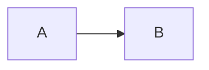
````

## Flowchart

Use for processes, decisions, data flow, ownership lanes made with subgraphs,
and the most portable architecture overview.

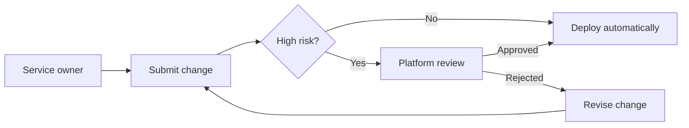

Use `LR` for a short sequence and `TB` when `LR` becomes too wide. Use labeled
subgraphs for real boundaries:

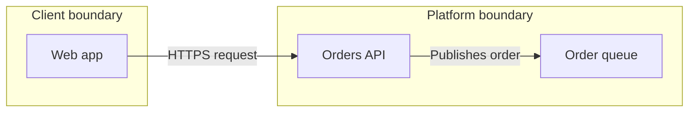

## Sequence diagram

Use for one runtime scenario where order, responses, concurrency, or failure
paths matter.

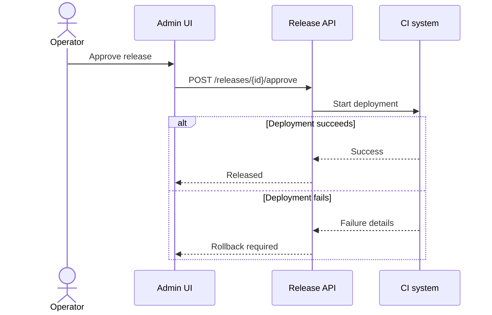

Declare participants in the desired order. Use solid arrows for calls and
dashed arrows for returns when that distinction matches the actual protocol.
Use `alt`, `opt`, `loop`, and `par` only when the branch has reader value.

## C4 context and container

Use C4 context for people, external systems, and the system boundary. Use C4
container for deployable applications and data stores. Mermaid documents C4 as
experimental; validate it in the target renderer.

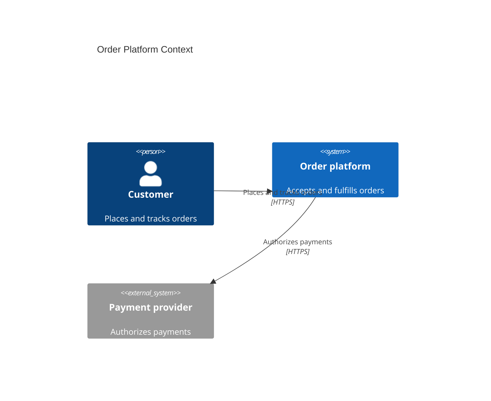

For a container view, change the declaration and use a boundary:

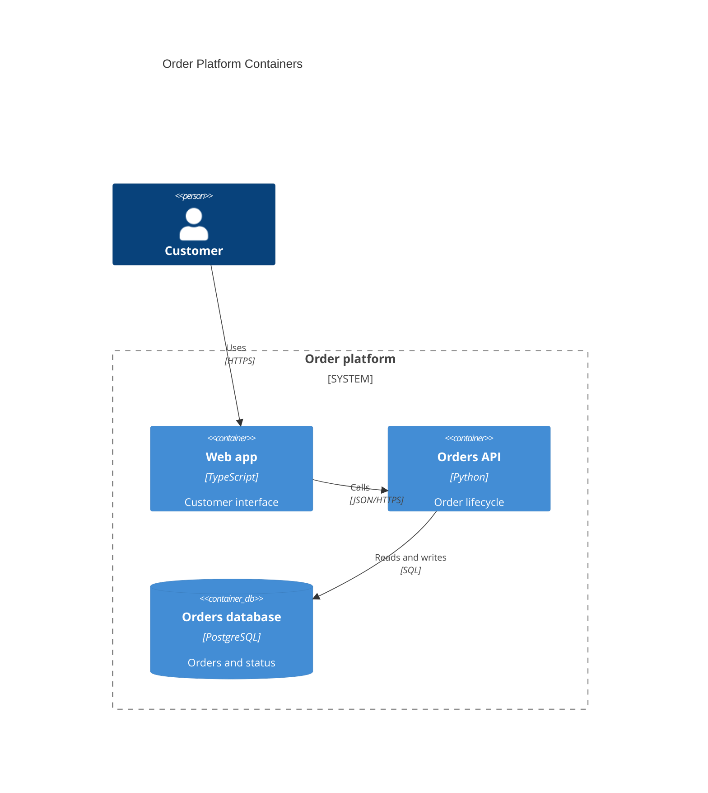

Do not use a C4 container as a component inventory. Include only containers and
relationships needed for the viewer's architecture question.

## Architecture diagram

Use for cloud or CI/CD resource topology where ports and resource icons clarify
connections. The declaration is version-sensitive and currently beta.

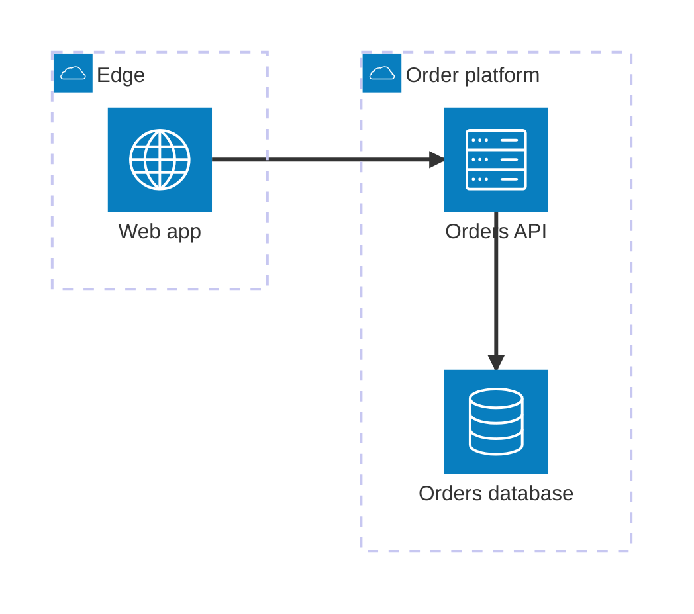

Declare a group or service before referencing it. Architecture edges connect
explicit sides (`L`, `R`, `T`, `B`); choose sides that preserve the reading path.
Use a flowchart when custom or unsupported resource icons would obscure meaning.

## State diagram

Use for allowed lifecycle transitions and terminal outcomes.

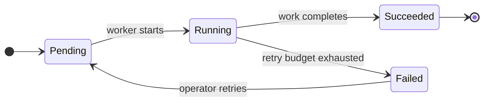

Name states as conditions and transitions as events or guards. Show exceptional
and terminal states; omitting them can make an operational lifecycle misleading.

## Entity relationship diagram

Use for data entities, cardinality, ownership, and a bounded schema view.

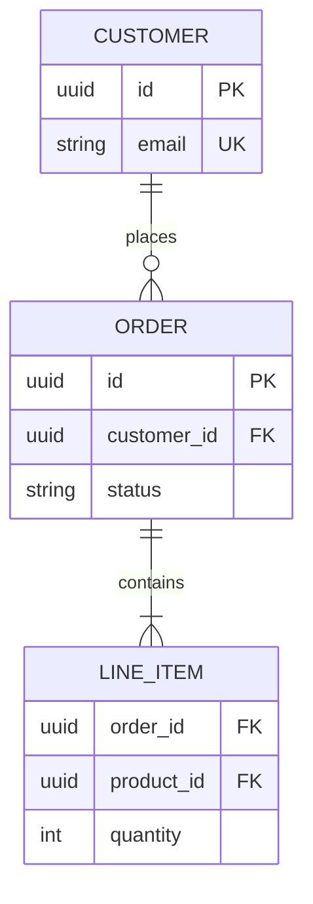

Use singular entity names. Match cardinality and optionality to the schema or
domain contract. Include only attributes necessary for the reader's question;
an overview is not a schema dump.

## Gantt chart

Use for dated work, duration, dependency, and critical-path communication.

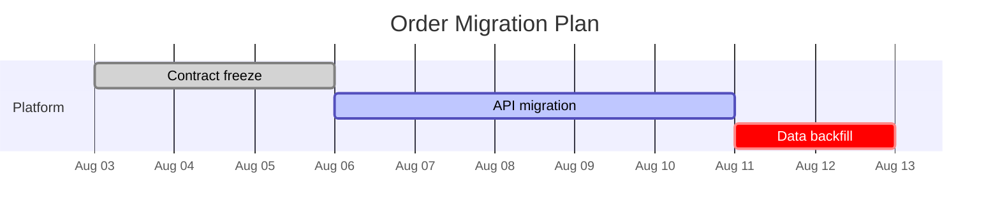

Use real dates and dependencies. Mark `done`, `active`, or `crit` only from an
authoritative plan. If dates are uncertain, show milestones in a timeline or
state uncertainty in surrounding prose instead of inventing precision.

## Timeline

Use for chronology or roadmap milestones when duration and dependency do not
matter. Mermaid documents timeline as experimental.

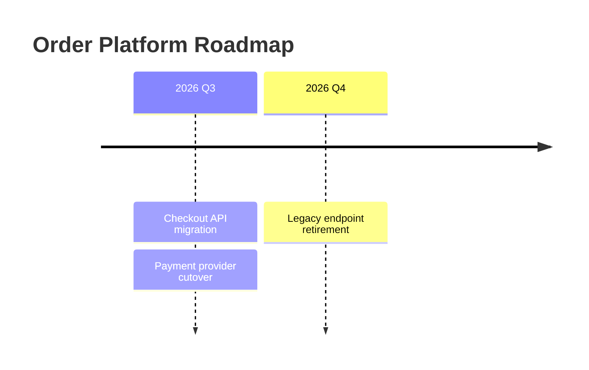

Keep periods comparable and order them chronologically. Do not use a timeline
when overlapping work or critical dependencies are the point; use Gantt.

## User journey

Use for a bounded user or operator task with experience scores and participants.

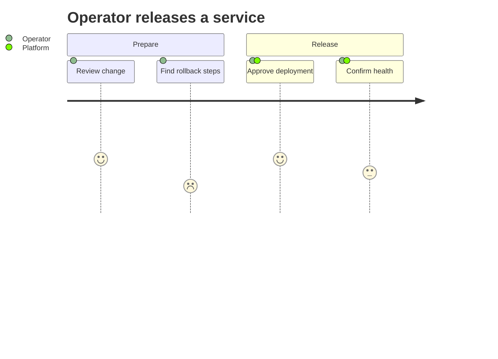

Scores must be 1 through 5. Name the scoring interpretation in surrounding prose
and ground scores in research or an explicit workshop; never fabricate sentiment.

## Quadrant chart

Use for a small, explicit comparison on two normalized decision criteria.

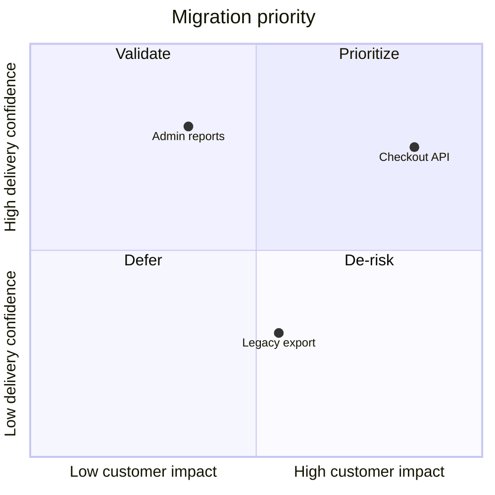

Coordinates range from 0 to 1. Define how scores were derived and avoid false
precision. Use a table or analysis tool when readers need underlying evidence,
uncertainty, or more than two criteria.

## Presentation frontmatter

Preserve the host theme by default. For a standalone artifact on a confirmed
Mermaid 11.16 renderer, this is a tested starting point:

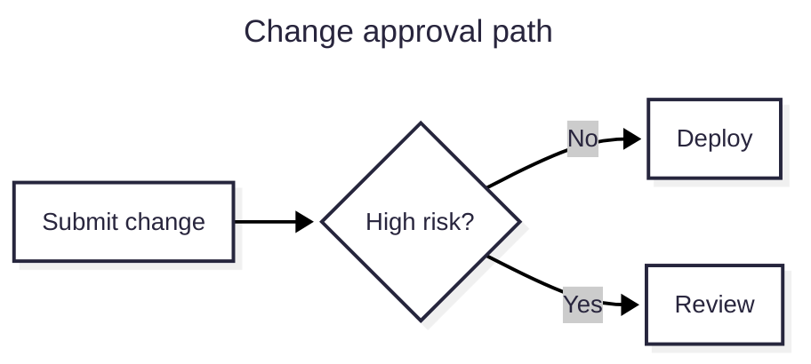

Use `neutral` for print-oriented output. Do not copy presentation frontmatter
into a host whose renderer version or allowed configuration is unknown.

## Syntax repair checklist

- Confirm the declaration and capitalization.
- Confirm every block (`subgraph`, `alt`, state body, C4 boundary) closes.
- Replace display text used as an ID with a simple ID plus a quoted label.
- Quote punctuation-heavy labels and lowercase `end` in flowcharts.
- Check arrow grammar for the selected diagram type; flowchart, sequence, C4,
  architecture, state, and ER arrows are not interchangeable.
- Remove unsupported frontmatter before changing otherwise valid diagram logic.
- Distinguish renderer setup errors from parser errors. A missing browser in
  Mermaid CLI does not mean the `.mmd` syntax is wrong.
- Re-render after the smallest repair and inspect the artifact, not only stdout.

## Official syntax pages

- <https://mermaid.js.org/syntax/flowchart.html>
- <https://mermaid.js.org/syntax/sequenceDiagram.html>
- <https://mermaid.js.org/syntax/c4.html>
- <https://mermaid.js.org/syntax/architecture.html>
- <https://mermaid.js.org/syntax/stateDiagram.html>
- <https://mermaid.js.org/syntax/entityRelationshipDiagram.html>
- <https://mermaid.js.org/syntax/gantt.html>
- <https://mermaid.js.org/syntax/timeline.html>
- <https://mermaid.js.org/syntax/userJourney.html>
- <https://mermaid.js.org/syntax/quadrantChart.html>
